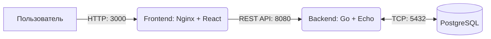

# Общая документация проекта SkillTracker

Добро пожаловать в проект **SkillTracker**! Это приложение, состоящее из клиентского интерфейса (Frontend) и серверной части (Backend) с базой данных PostgreSQL. 

Все компоненты сервиса разворачиваются и оркестрируются с помощью `docker-compose`.

## 🏗 Архитектура приложения

Архитектура проекта построена на классической клиент-серверной модели:



### Основные компоненты:
1. **[FrontendSkillTracker](./FrontendSkillTracker/README.md)** — Клиентское одностраничное приложение (SPA), написанное на React + Vite с использованием TypeScript, Radix UI (Shadcn) и TailwindCSS.
2. **[BackendSkillTracker](./BackendSkillTracker/README.md)** — REST API сервер на языке Go (с использованием фреймворка Echo), отвечающий за авторизацию (JWT), бизнес-логику и взаимодействие с базой.
3. **БД PostgreSQL** — Реляционная база данных для хранения информации о пользователях, задачах и комментариях.

## 🚀 Быстрый старт (Docker Compose)

Для запуска всего проекта одной командой вам понадобится установленный [Docker](https://www.docker.com/) и [Docker Compose](https://docs.docker.com/compose/).

1. Клонируйте репозиторий и перейдите в его корневую директорию.
2. Выполните команду запуска среды:

```bash
docker-compose up --build
```

Docker Compose выполнит следующие шаги:
- Создаст сеть для взаимодействия контейнеров.
- Запустит БД `postgres:15` и применит миграции из папки `BackendSkillTracker/migrations`.
- Соберёт и запустит бэкенд на порту `8080`.
- Соберёт и запустит фронтенд на порту `3000`.

### Доступ к сервисам после запуска:
- **Frontend App**: http://localhost:3000
- **Backend API**: http://localhost:8080/api/v1
- **База данных**: `localhost:5432` (пользователь: `postgres`, пароль: `12345678`, БД: `skillstracker`)

> **[TIP]** Администратор по умолчанию создаётся автоматически (username: `admin` / password: `admin123`).

## 📁 Структура директорий

```
/
├── BackendSkillTracker/    # Исходный код бэкенда (Go)
├── FrontendSkillTracker/   # Исходный код фронтенда (React/Vite)
├── docker-compose.yml      # Файл оркестрации контейнеров
└── README.md               # Этот файл
```

Для более подробного ознакомления с каждой частью, пожалуйста, изучите README файлы в соответствующих директориях.
